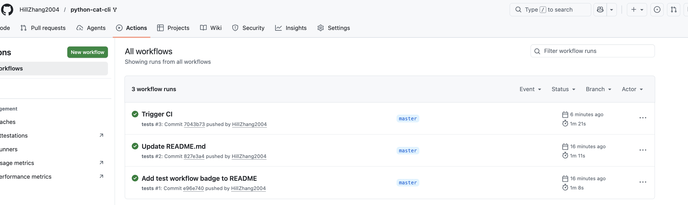

# Python cat, streaming I/O, O(1) memory

A small Python implementation of the Unix `cat` utility that streams bytes from files or stdin to stdout using constant memory.

## Usage

Print a file:

```bash
python3 cat.py README.md
python3 cat.py cat.py
```
## CI


